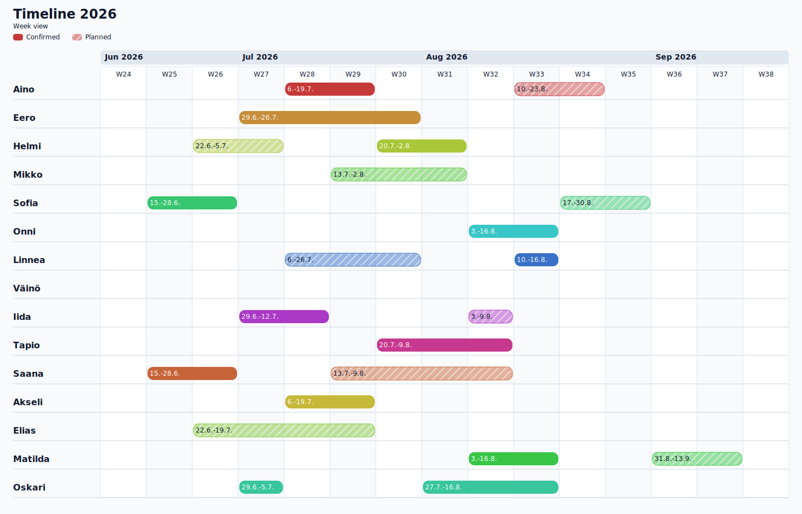

<div align="center">

# Timelines

**CSVs to timelines**

Render people-and-period CSVs as standalone HTML and SVG timelines. Runs as a Python CLI with zero third-party dependencies, or in the browser via Pyodide.

[](LICENSE)
[](https://www.python.org/downloads/)
[](pyproject.toml)
[](https://laveez.github.io/timelines/)

</div>

---

### Contents

[Features](#features) · [Screenshot](#screenshot) · [Quick Start](#quick-start) · [Input Format](#input-format) · [CLI Flags](#cli-flags) · [Palettes](#palettes) · [How It Works](#how-it-works) · [Contributing](#contributing)

---

## Features

- **Week or day scale** (`--scale`) for column granularity
- **Confirmed and planned periods** rendered as solid or diagonally-striped bars
- **Three bundled palettes**: `dark`, `light`, and the mathematically-even `uniform` preset, plus fully custom color lists
- **Automatic color interpolation** in HLS space when rows exceed palette size, subdivided with a van der Corput sequence so extras stay evenly spaced
- **Per-bar WCAG contrast** (`--text-mode auto`) or classic fixed rule (`--text-mode fixed`)
- **Built-in demo**: `python3 timelines.py` with no arguments renders the bundled example
- **Zero third-party runtime dependencies**, Python 3.10+
- **Browser companion** at [laveez.github.io/timelines](https://laveez.github.io/timelines/) runs the same `timelines.py` via Pyodide. Edit via Cards, Grid, or Raw CSV and get live HTML, SVG, and PNG output.

## Screenshot



## Quick Start

Clone and run:

```bash
git clone https://github.com/laveez/timelines.git
cd timelines
python3 timelines.py
```

Renders the bundled example into `timelines.html` and `timelines.svg`. Run with `--help` for the full flag list.

Install as a CLI:

```bash
pip install git+https://github.com/laveez/timelines.git
timelines timelines.csv
```

Or open [laveez.github.io/timelines](https://laveez.github.io/timelines/) in a browser. No install needed.

## Input Format

Each row is one person. The first cell is the name; after that, periods come in `status,start,end` triplets.

```csv
Aino,C,2026-07-21,2026-07-27,P,2026-08-01,2026-08-15
Eero,C,2026-06-22,2026-07-12
Helmi
```

- All dates use ISO 8601 (`YYYY-MM-DD`).
- `C` is confirmed (solid bar), `P` is planned (striped bar).
- The end date must be on or after the start date.
- A row with only a name renders as an empty row.

## CLI Flags

| Flag | Description |
|---|---|
| `<input.csv>` | CSV input path (positional) |
| `--scale day\|week` | Column granularity. Default: `week` |
| `--title TEXT` | Header title. Default: `Timeline` |
| `--subtitle TEXT` | Header subtitle. Default: `<Scale> view` |
| `--palette NAME\|LIST` | `dark`, `light`, `uniform`, or a comma-separated color list. Default: `dark` |
| `--text-mode auto\|fixed` | Bar text color rule. Default: `auto` |
| `--padding-days N` | Extra days shown on each side of the timeline. Default: `2` |
| `--from YYYY-MM-DD` | Clip the timeline to start at this date (inclusive) |
| `--to YYYY-MM-DD` | Clip the timeline to end at this date (inclusive) |
| `--html-output PATH` | HTML output path. Default: `timelines.html` for the bundled input, otherwise `gitignored/<stem>.html` |
| `--svg-output PATH` | SVG output path. Default: `timelines.svg` for the bundled input, otherwise `gitignored/<stem>.svg` |

Run `python3 timelines.py --help` for the argparse-generated reference.

## Palettes

```bash
python3 timelines.py timelines.csv --palette dark
python3 timelines.py timelines.csv --palette uniform
python3 timelines.py timelines.csv \
  --palette "#0B1F66,#00A1DE,#D7192D,#8FBBD9"
```

The `uniform` preset spaces 10 hues evenly on the color wheel (36° apart) at constant lightness and saturation for maximum visual separation. When a CSV has more rows than palette colors, additional colors get interpolated in HLS space between adjacent entries. A van der Corput sequence drives the subdivision so wrapped colors land in the gaps between existing ones rather than colliding with them.

## How It Works

```
CSV input → parse_csv → Person / Period objects → render_svg → standalone SVG
                                                       ↓
                                                  render_html → self-contained HTML
```

The CLI uses only the Python standard library (`argparse`, `csv`, `colorsys`, `html`, `datetime`). SVG is built as plain strings, with no templating engine. The browser companion under [`web/`](web/) wraps React, Vite, and Tailwind v4 around Pyodide, which loads the same `timelines.py` via a symlink in `web/public/`. One code path, identical output.

GitHub Actions CI builds the sdist and wheel on Python 3.10 through 3.13 and smoke-tests every palette, text mode, and scale. A separate Pages workflow deploys the browser companion on every push to `main`.

## Contributing

Contributions are welcome. Open an issue first for bigger changes so we can talk through the approach.

## License

[MIT](LICENSE) © 2026 [laveez](https://github.com/laveez)
